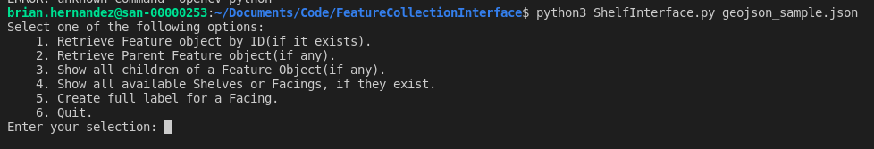

# FeatureCollection Interface

This is a CLI app used to demonstrate an interface with a geoJSON object utilzing class structure and object inheritance in python.
Included is a sample geoJSON file containing the structure that this app will process.

## Requirements

- python3.8 or higher
- opencv 3.0

## Usage

This is setup with a basic CLI format to simply demonstrate output in string format, and returns the values as well.
Simply run  
`python3 ShelfInterface.py {your_geoJSON_file}.json`  
To open up the CLI menu.  

Use the numbered menu options to select an operation.  
Then, if prompted, provide the requested data to fetch the corresponding data.  
Be sure to verify the structure of the data in the provided `geojson_sample.json` before doing so.  
The process will fail to run if the format is incorrect, and you will see an error in python in this case.  
